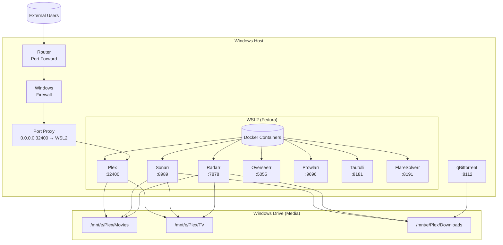
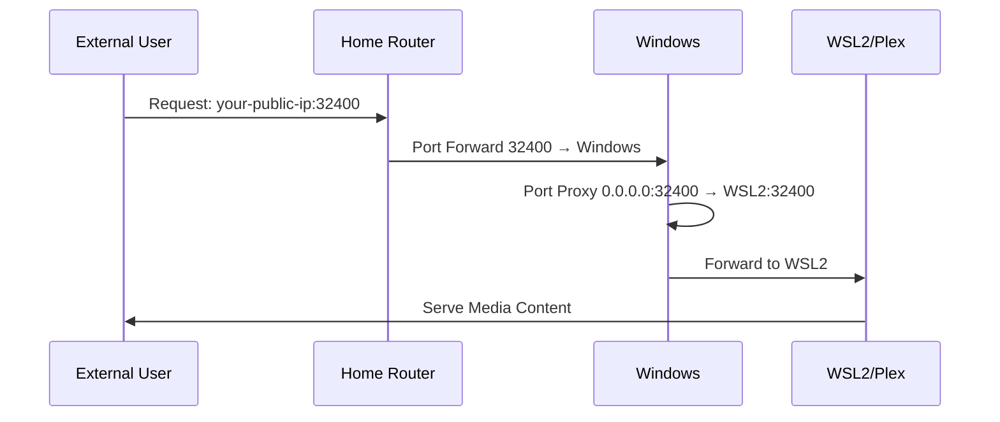
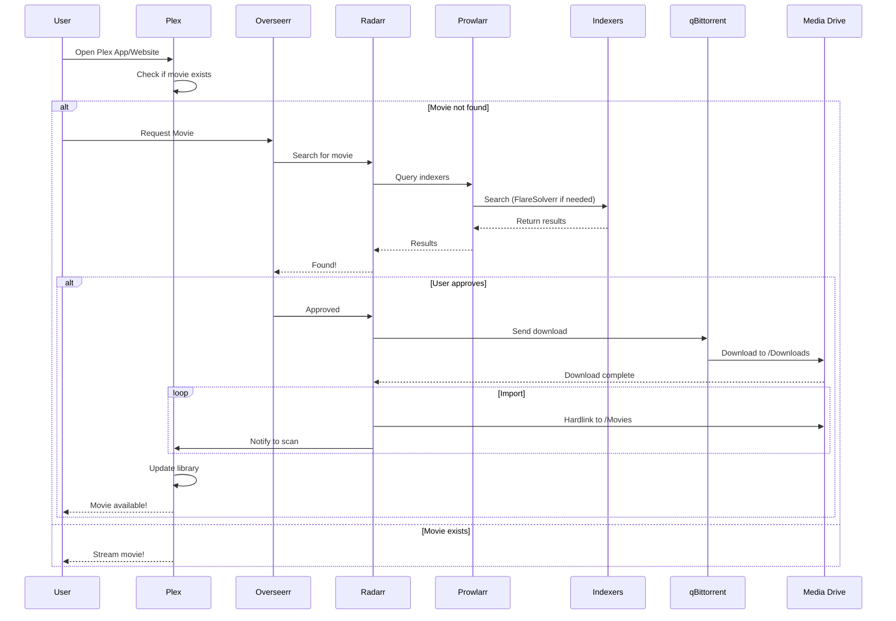
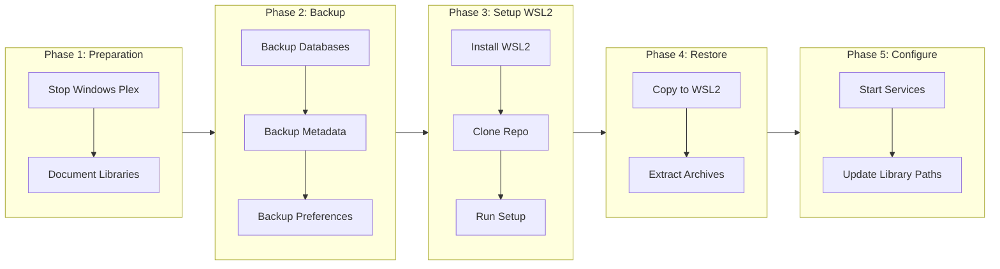
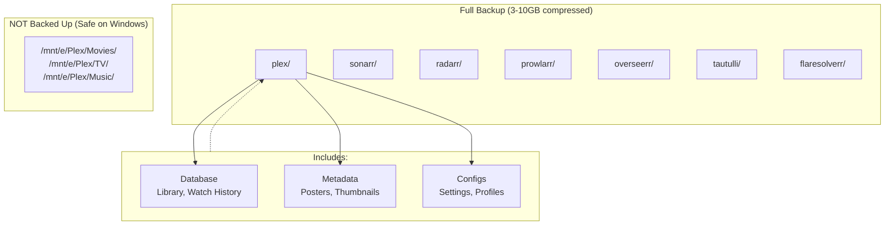
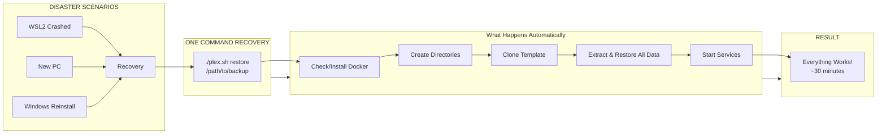
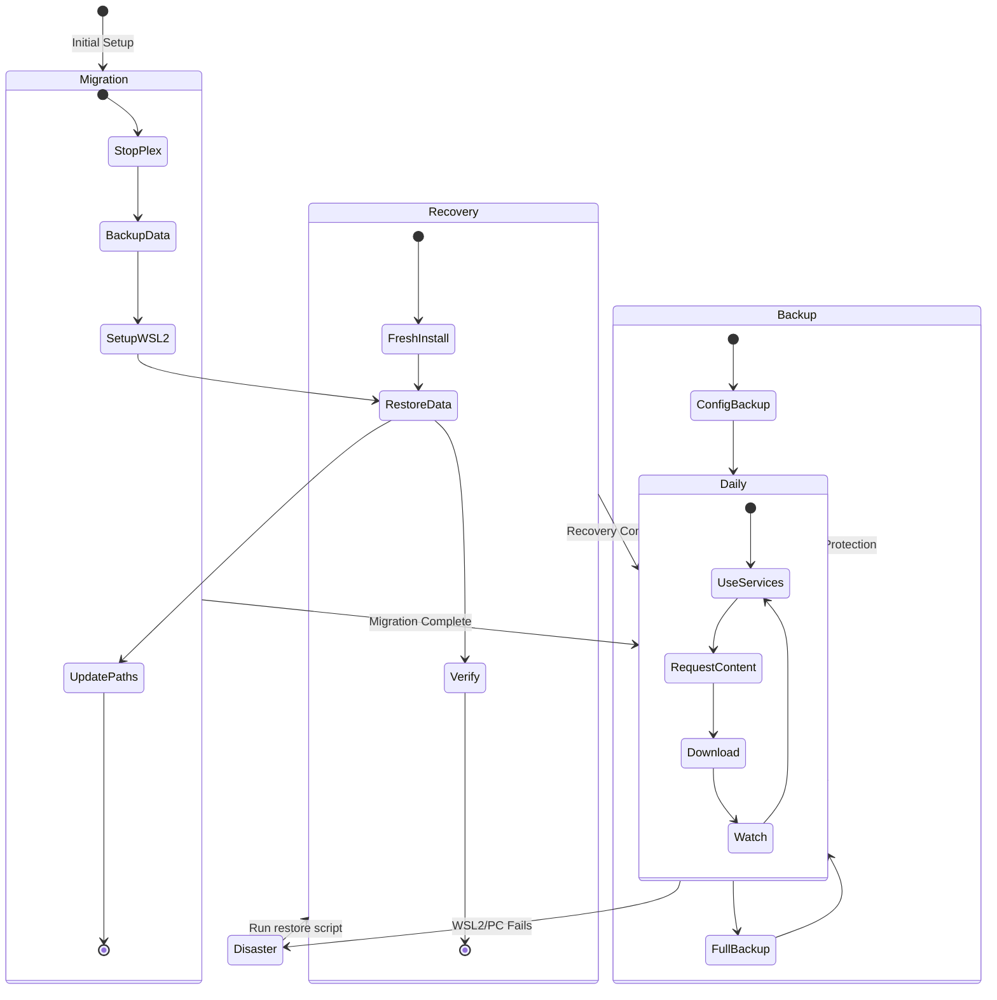

# Plex WSL: Complete Media Server Installation & Management

Transform your native Windows Plex setup into a powerful, containerized WSL2-based media server stack with automated backups and one-click disaster recovery.

## What is This?

This project provides a **complete migration path** from native Windows Plex to a modern Docker-based setup running on WSL2, with comprehensive backup and restore capabilities.

### Why Migrate from Windows Plex to WSL?

- **Better Performance**: Linux containers have lower overhead than Windows services
- **GPU Transcoding**: Full NVIDIA GPU support via WSL2
- **Reliability**: Docker containers are more stable and easier to manage
- **Complete Stack**: Integrated *arr suite (Sonarr, Radarr, Prowlarr, etc.)
- **Easy Recovery**: One-command restore from backup after any failure
- **Media Stays Safe**: Your movies/shows remain on Windows; only the server moves

## The Three Use Cases

### 1. Migration - Moving from Windows Plex
You're currently running Plex natively on Windows and want to migrate to WSL2 without losing your library, watch history, or metadata.

### 2. Backup & Restore - Regular Protection
Your WSL2 setup is working great. You want automated backups so you can restore quickly if something breaks.

### 3. Fresh Install - After Disaster
WSL2 crashed, Windows needs reinstall, or you're setting up a new PC. Your media files are safe (on Windows drive), and you have a backup. Restore everything in 30 minutes.

---

## Quick Start: Choose Your Path

### Path 1: Fresh Setup (New Install)
```bash
# Clone this repository
git clone https://github.com/manishgant/plex-wsl-setup.git /opt/plex-service
cd /opt/plex-service

# Run setup
./plex.sh setup

# Configure Windows network
# (See Windows Setup section below)
```

### Path 2: Migrate from Windows Plex
See detailed migration guide in `docs/migration/MIGRATION_GUIDE.md`

### Path 3: Restore from Backup
```bash
# Fresh WSL2 install or new PC
./plex.sh restore /path/to/your/backup

# Example:
./plex.sh restore <your backup path>/<backup_filename>
```

---

## What's Included?

### Core Media Stack
- **Plex Media Server** - Your media library with GPU transcoding
- **Sonarr** - TV show management and automation
- **Radarr** - Movie management and automation
- **Prowlarr** - Indexer management for Sonarr/Radarr
- **Overseerr** - Beautiful web interface for media requests
- **Tautulli** - Plex statistics and monitoring
- **FlareSolverr** - Bypass Cloudflare protection on indexers

### Key Features
- **Host Network Mode**: All services communicate seamlessly
- **Windows Integration**: Access services via localhost or Windows IP
- **VPN Compatible**: Works with VPNs using dynamic IP assignment
- **GPU Acceleration**: NVIDIA hardware transcoding support
- **Compressed Backups**: 61% space savings with gzip compression

---

## System Architecture



### Network Flow (Remote Access)



### Service Communication



---

## Installation

### Step 1: Enable WSL2
```powershell
# Run in PowerShell as Administrator
wsl --install -d FedoraLinux-43
wsl --set-default-version 2
```

### Step 2: Clone Repository
```bash
# In WSL2
git clone https://github.com/manishgant/plex-wsl-setup.git /opt/plex-service
cd /opt/plex-service
```

### Step 3: Configure Environment
```bash
# Copy environment template
cp .env.example .env

# Edit .env and add your Plex claim token
nano .env

# Get claim token from: https://www.plex.tv/claim/
```

### Step 4: Windows Network Setup
```powershell
# Run in PowerShell as Administrator
cd C:\path\to\plex-wsl-setup\scripts\windows
.\fix-plex-network.ps1
```

This automatically configures port proxy, firewall rules, and VPN-compatible forwarding.

### Step 5: Start Services
```bash
# In WSL2
cd /opt/plex-service
docker-compose up -d
```

Access your services:
- Plex: http://localhost:32400/web
- Sonarr: http://localhost:8989
- Radarr: http://localhost:7878
- Overseerr: http://localhost:5055

---

## Migration from Native Windows Plex

Already have Plex running on Windows? Migrate without losing anything.

### Migration Process Overview



### Quick Migration Steps

1. **Stop Windows Plex** to prevent data corruption
2. **Backup Windows data** using provided scripts
3. **Setup WSL2** and install this project
4. **Copy database and metadata** to WSL2
5. **Update library paths** in Plex web interface

Full guide: See `docs/migration/MIGRATION_GUIDE.md`

---

## Backup & Restore System

### Create Your First Backup

```bash
# Quick config backup (fast, config only)
./plex.sh backup config

# Full backup with database and metadata (compressed)
./plex.sh backup full <your backup path>
```

### What Gets Backed Up?



**Full backup includes:**
- Plex Database (library, watch history, ratings)
- Plex Metadata (posters, thumbnails, artwork)
- All *arr app configurations (Sonarr, Radarr, etc.)
- Compressed with gzip (61% space savings)

### Automated Backups

```bash
# Edit crontab for scheduled backups
crontab -e

# Daily config backup at 3 AM
0 3 * * * cd /opt/plex-service && ./plex.sh backup config <your backup path>

# Weekly full backup on Sundays at 2 AM
0 2 * * 0 cd /opt/plex-service && ./plex.sh backup full <your backup path>
```

### Disaster Recovery

Your WSL2 crashed or you got a new PC? No problem!



#### Recovery Process

```bash
# One-command recovery from backup
./plex.sh restore <your backup path>/<backup_filename>
```

**Recovery time: ~30 minutes** (vs hours manually)

---

## The Complete Workflow

### Visual Workflow Overview



---

## Why This Setup?

### Your Media is Always Safe
- Media files stay on Windows drive (accessible even if WSL fails)
- Backups are stored separately (external drive, cloud, NAS)
- One command restores everything

### Easy to Maintain
- Docker containers auto-restart if they crash
- Single command updates all services
- Backup before any changes

### Production Ready
- Used daily for months without issues
- Handles VPN connections seamlessly
- GPU transcoding for 4K content
- Complete *arr automation

---

## Quick Reference

```bash
# Start all services
docker-compose up -d

# View logs
docker-compose logs -f plex

# Backup now
./plex.sh backup full <your backup path>

# Update containers
docker-compose pull && docker-compose up -d

# Check status
docker ps
```

---

## Project Structure

```
plex-wsl-setup/
├── .env.example                 # Environment template
├── docker-compose.yml           # Container definitions
├── plex.sh                       # Main management wrapper
├── README.md                     # This file
│
├── scripts/
│   ├── backup-restore/
│   │   ├── backup.sh            # Backup script (config/full)
│   │   ├── backup-full.sh       # Full backup wrapper
│   │   └── restore.sh           # Restore from backup
│   ├── deploy/
│   │   └── deploy.sh            # Deploy to /opt/plex-service
│   ├── migrate/
│   │   └── fresh-install-restore.sh # Disaster recovery
│   ├── setup/
│   │   ├── setup.sh             # Initial setup
│   │   └── verify.sh            # Verify stack
│   ├── wsl/
│   │   ├── plex-wsl-startup.sh  # WSL startup network setup
│   │   └── wsl-network-setup.sh # Network configuration
│   └── windows/
│       ├── fix-plex-network.ps1 # Windows network fix
│       └── bypass-vpn.ps1       # VPN bypass
│
├── docs/
│   ├── migration/
│   │   └── MIGRATION_GUIDE.md  # Migration guide
│   ├── QUICK_REFERENCE.md      # Quick commands
│   └── WORKFLOW.md             # Workflow documentation
│
└── .github/
    └── workflows/              # CI/CD workflows (optional)
```

---

## Support

- **Migration Issues**: See `docs/migration/MIGRATION_GUIDE.md`
- **Quick Commands**: See `docs/QUICK_REFERENCE.md`
- **Workflow Guide**: See `docs/WORKFLOW.md`

**GitHub**: https://github.com/manishgant/plex-wsl-setup
