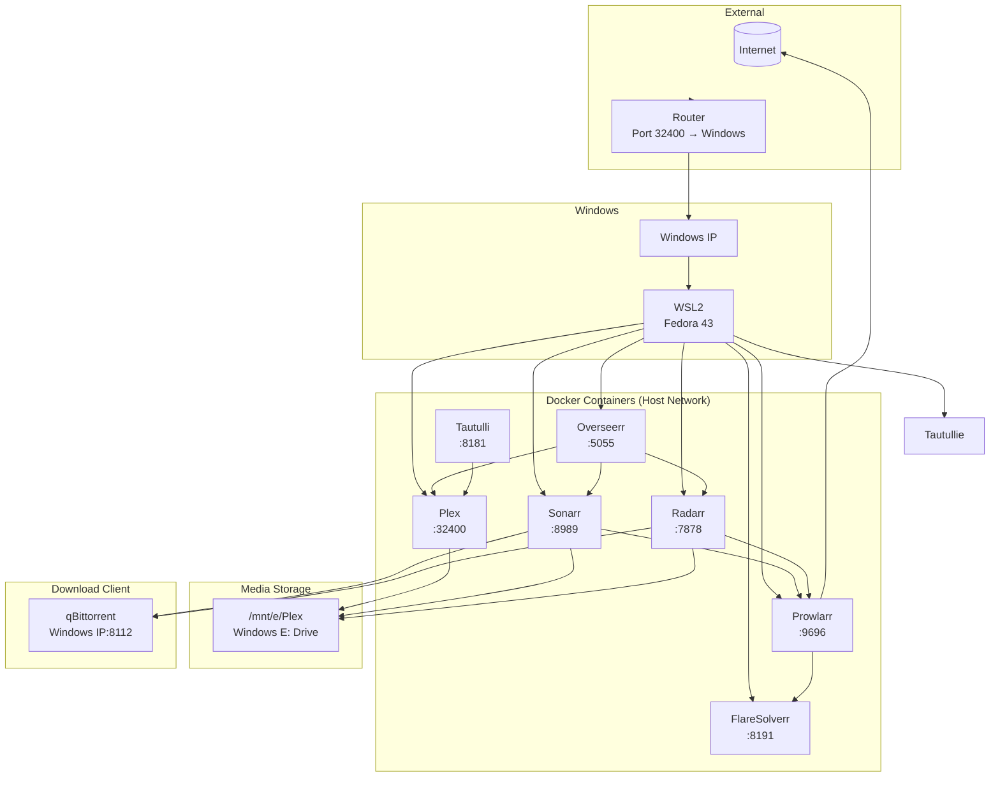
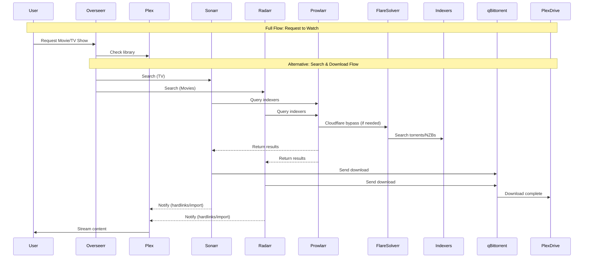
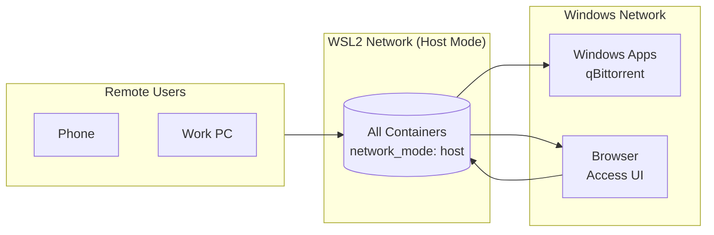

# Plex Media Server on WSL2

This document provides a detailed walkthrough of the complete Plex media server stack running on WSL2 with Docker.

## Documentation

- **Setup**: This guide (README.md)
- **Migration from Windows Plex**: See [docs/migration/](docs/migration/MIGRATION_GUIDE.md)
- **Quick Reference**: See [docs/QUICK_REFERENCE.md](docs/QUICK_REFERENCE.md)
- **Workflow**: See [docs/WORKFLOW.md](docs/WORKFLOW.md)

## Architecture Overview



## Service Connections



## Network Architecture



## Setup Prerequisites

### 1. Windows Setup

#### Enable WSL2
```powershell
# Run in PowerShell as Administrator
wsl --install
wsl --set-default-version 2
```

#### Port Forwarding
1. **Router**: Forward port `32400` (TCP) to your Windows IP (e.g., `192.168.0.x`)
2. **Windows Firewall**: Already handled by container firewall rules

#### Windows Port Proxy (WSL2)
Run in PowerShell (Admin):
```powershell
# Get WSL2 IP
$wslIp = (wsl hostname -I).Trim().Split()[0]

# Set up port proxy with 0.0.0.0 (catches all interfaces - works with VPN)
netsh interface portproxy add v4tov4 listenport=32400 listenaddress=0.0.0.0 connectport=32400 connectaddress=$wslIp

# Optional: Also add specific Windows IP if needed
# netsh interface portproxy add v4tov4 listenport=32400 listenaddress=192.168.0.x connectport=32400 connectaddress=$wslIp
```

**Note:** Using `0.0.0.0` instead of a specific IP allows Plex to work with VPNs that assign dynamic IPs. The portproxy will forward traffic from any Windows interface to WSL.

**Alternative: Automated Script**
Run the provided PowerShell script (as Administrator):
```powershell
.\fix-plex-network.ps1
```
This script automatically configures firewall rules and port proxy with the correct WSL IP.

### 2. WSL2 Setup

#### Install Docker
```bash
sudo dnf install -y docker
sudo systemctl enable --now docker
sudo usermod -aG docker $USER
```

#### Start Services
```bash
cd /opt/plex-service
docker-compose up -d
```

## Initial Configuration

### 1. Plex Setup

1. Visit: http://localhost:32400
2. Sign in with Plex account
3. Claim your server (use PLEX_CLAIM_TOKEN if setting up fresh)
4. Configure library paths:
   - Add folder: `/data` → maps to `/mnt/e/Plex`

#### Remote Access
- Settings → Remote Access
- Should show: "Fully accessible outside your network"
- If relay is enabled (slow), disable by editing:
  ```bash
  sed -i 's/RelayEnabled="1"/RelayEnabled="0"/' "/opt/plex-service/config/plex/Library/Application Support/Plex Media Server/Preferences.xml"
  docker-compose restart plex
  ```

### 2. qBittorrent Setup

qBittorrent runs on Windows, accessible by containers at `YOUR_WINDOWS_IP:8112`.

1. Access qBittorrent: http://YOUR_WINDOWS_IP:8112
2. Configure in Sonarr/Radarr:
   - Settings → Download Clients → Add → qBittorrent
   - Host: `YOUR_WINDOWS_IP`
   - Port: `8112`
   - Username: (your qBittorrent user)
   - Password: (your qBittorrent pass)

### 3. Prowlarr Setup

1. Visit: http://localhost:9696
2. Go to **Settings → Indexers**
3. Add indexers (e.g., 1337x, RARBG, or private trackers)
4. For Cloudflare-protected trackers, enable FlareSolverr:
   - Settings → General → FlareSolverr
   - URL: `http://localhost:8191`

### 4. Sonarr & Radarr Setup

#### Connect to Prowlarr
1. Visit Sonarr: http://localhost:8989
2. Go to **Settings → Apps**
3. Add Application → Prowlarr
   - Prowlarr Server: `http://localhost:9696`
   - API Key: (from Prowlarr → Settings → General → API Key)
4. Repeat for Radarr: http://localhost:7878

#### Add Media Folders
1. **Sonarr**: Settings → Media Management → Add Root Folder → `/data`
2. **Radarr**: Settings → Media Management → Add Root Folder → `/data`

#### Connect Download Client
1. Settings → Download Clients → Add → qBittorrent
2. Host: `YOUR_WINDOWS_IP`, Port: `8112`

### 5. Overseerr Setup

1. Visit: http://localhost:5055
2. Connect Plex: Sign in with Plex account
3. Sonarr/Radarr should auto-connect via Plex authentication

### 6. Tautulli Setup

1. Visit: http://localhost:8181
2. Connect to Plex: Settings → Plex Media Server
   - Plex Token: (from Plex → Account → API)

## Port Reference

| Service | Internal Port | External URL | Description |
|---------|--------------|--------------|-------------|
| Plex | 32400 | http://localhost:32400 | Media Server |
| Plex | 32469 | - | DLNA/Remote |
| Sonarr | 8989 | http://localhost:8989 | TV Management |
| Radarr | 7878 | http://localhost:7878 | Movie Management |
| Prowlarr | 9696 | http://localhost:9696 | Indexer Manager |
| FlareSolverr | 8191 | http://localhost:8191 | Cloudflare Bypass |
| Overseerr | 5055 | http://localhost:5055 | Request Portal |
| Tautulli | 8181 | http://localhost:8181 | Monitoring |
| qBittorrent | 8112 | http://YOUR_WINDOWS_IP:8112 | Download Client |

## VPN Considerations

All containers use `network_mode: host`, meaning they use WSL2's network directly. If running a VPN:

### VPN Bypass Script
If your VPN routes all traffic and blocks Plex remote access:

```bash
# Run the bypass script
sudo /opt/plex-service/plex-vpn-bypass.sh
```

This routes Plex container traffic outside the VPN tunnel.

## Backup & Restore

### Usage

```bash
./backup-config.sh [config|full] [backup_location]
```

**Arguments:**
- `config` - Backup configuration only (fast, ~1MB)
- `full` - Backup config + database + metadata (compressed, 3-10GB)
- `backup_location` - Optional: Where to store backups (default: `./backups/`)

### Quick Configuration Backup (Fast)
Backs up only configuration files - fast and small:
```bash
# Default location (./backups/)
./backup-config.sh config

# Custom location
./backup-config.sh config /mnt/e/Plex/Backups
```

**Includes:**
- docker-compose.yml
- .env file
- Plex Preferences.xml (settings, custom connections, etc.)
- .wslconfig (Windows WSL settings)
- Network configuration documentation
- PowerShell fix scripts

### Full Backup (Complete)
Backs up everything including database and metadata - slow but complete:
```bash
# Default location (./backups/)
./backup-config.sh full

# To DrivePool or external drive (recommended for redundancy)
./backup-config.sh full /mnt/e/Plex/Backups

# To external drive
./backup-config.sh full /media/external/plex-backups
```

**Includes everything from config backup PLUS:**
- **Plex Database** - Library, watch history, user data, ratings
- **Plex Metadata** - Posters, thumbnails, artwork (can be 3GB+)
- **Plex Media Assets** - Transcode cache, intro detection
- **All *arr Applications** - Sonarr, Radarr, Prowlarr, Overseerr, Tautulli, FlareSolverr configs
- **Plug-ins** - Any custom Plex plugins

**Why use an external/different backup location?**
- **Redundancy:** Store on DrivePool, NAS, or external drive
- **Safety:** Backups survive WSL/Linux reinstalls
- **Accessibility:** Access backups from Windows
- **Space:** Large backups don't fill up WSL disk

**Backup creates this structure:**
```
backups/
├── config_20260214_120000/       # Quick config backup
│   ├── docker-compose.yml
│   ├── .env
│   ├── Preferences.xml
│   ├── .wslconfig
│   ├── network.config
│   ├── plex.env
│   └── restore.sh
│
└── full_20260214_120000/         # Full backup
    ├── docker-compose.yml
    ├── .env
    ├── Preferences.xml
    ├── .wslconfig
    ├── network.config
    ├── plex.env
    ├── plex-database/           # Library database
    ├── plex-metadata/           # Artwork & thumbnails
    ├── plex-media/              # Cache & assets
    ├── plex-plugins/            # Custom plugins
    ├── sonarr/                  # Sonarr config
    ├── radarr/                  # Radarr config
    ├── prowlarr/                # Prowlarr config
    ├── overseerr/               # Overseerr config
    ├── tautulli/                # Tautulli config
    ├── flaresolverr/            # FlareSolverr config
    └── restore.sh
```

### Restore from Backup

**Configuration-only restore:**
```bash
# Restore just configuration (safe, doesn't touch database)
./backups/latest/restore.sh
```

**Full restore (replaces everything!):**
```bash
# ⚠️ WARNING: This replaces your current Plex database!
./backups/full_20260214_120000/restore.sh
```

**After restore, update Windows portproxy:**
```powershell
# Run in PowerShell as Administrator
.\fix-plex-network.ps1
```

**Tip:** Set up a cron job for automated backups:
```bash
# Edit crontab
crontab -e

# Add daily config backup at 3 AM
0 3 * * * cd /opt/plex-service && ./backup-config.sh config

# Add weekly full backup on Sundays at 2 AM
0 2 * * 0 cd /opt/plex-service && ./backup-config.sh full
```

## Troubleshooting

### Containers Unhealthy
```bash
# Check logs
docker-compose logs <service>

# Restart specific service
docker-compose restart <service>

# Recreate service
docker-compose up -d --force-recreate <service>
```

### Can't Access Services
```bash
# Check if container is running
docker ps

# Check port is listening
curl http://localhost:<port>

# Check firewall
sudo iptables -L -n
```

### Network Issues
```bash
# Verify host network mode
docker inspect <container> | grep NetworkMode

# Check WSL2 IP
ip addr show eth0

# Test connectivity from container
docker exec <container> curl <target>
```

### Permission Issues
```bash
# Fix ownership
sudo chown -R 1000:1000 /opt/plex-service/config/
```

## Maintenance

### Update Containers
```bash
docker-compose pull
docker-compose up -d
```

### Clean Up
```bash
# Remove unused images
docker image prune -a

# Remove unused volumes (careful!)
docker volume prune
```

## File Structure

```
/opt/plex-service/
├── docker-compose.yml      # Service definitions
├── .env                    # Environment variables
├── config/                 # Container configs
│   ├── plex/              # Plex config & database
│   ├── sonarr/            # Sonarr config
│   ├── radarr/            # Radarr config
│   ├── prowlarr/          # Prowlarr config
│   ├── flaresolverr/      # FlareSolverr config
│   ├── overseerr/         # Overseerr config
│   └── tautulli/          # Tautulli config
├── backups/               # Config backups
└── ffmpeg*/              # FFmpeg (optional)

/mnt/e/Plex/              # Media from Windows
├── Movies/
├── TV/
├── Music/
├── Downloads/
└── ...
```

## Security Notes

- All API keys and secrets should be configured via GUI or environment
- Keep `.env` file secure (not committed to git)
- Use strong passwords for qBittorrent web UI
- Consider enabling authentication on all services

## Quick Reference

```bash
# Start stack
docker-compose up -d

# Stop stack
docker-compose down

# View logs
docker-compose logs -f

# Restart specific service
docker-compose restart plex

# Check status
docker ps

# Update all
docker-compose pull && docker-compose up -d
```

---

**Last Updated:** 2026-02-14
